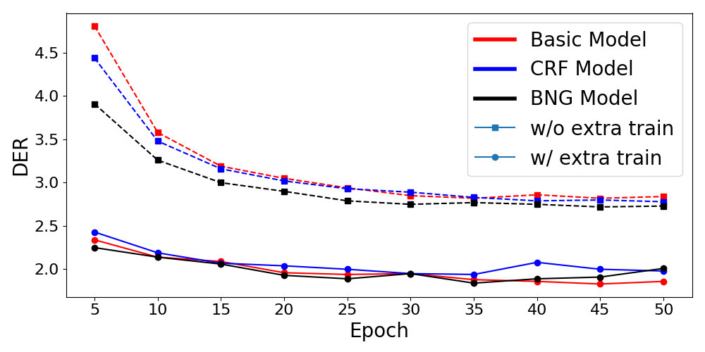

 [](https://paperswithcode.com/sota/arabic-text-diacritization-on-tashkeela?p=neural-arabic-text-diacritization-state-of-1)

# Shakkelha

This repository contains the models, dataset, helpers, and systems' comparison for our paper on Arabic Text Diacritization:

"[Neural Arabic Text Diacritization: State of the Art Results and a Novel Approach for Machine Translation](https://www.aclweb.org/anthology/D19-5229)", Ali Fadel, Ibraheem Tuffaha, Bara' Al-Jawarneh and Mahmoud Al-Ayyoub, [EMNLP-IJCNLP 2019](https://www.emnlp-ijcnlp2019.org).

## Files

- predict.py - General script that can be used to predict using any model existing in this repository
- sample-input - Sample input file

### [dataset](/dataset)

- extra_train.zip - Contains the extra training dataset that was used to train the models

### [comparisons](/comparisons)

- abandah - [Abandah et al., 2015](https://link.springer.com/article/10.1007/s10032-015-0242-2)
- belinkov - [Belinkov et al., 2015](https://www.aclweb.org/anthology/D15-1274)
- shakkala - [Barqawi et al., 2017](https://github.com/Barqawiz/Shakkala)

These folders each contain the generated dataset, system output and DER/WER statistics used to compair our system with each of the three systems.

### [helpers](/helpers)

- constants
  - ARABIC_LETTERS_LIST.pickle - Contains a list of Arabic letters
  - DIACRITICS_LIST.pickle - Contains a list of all diacritics
  - FFNN_CLASSES_MAPPING.pickle - Contains a dictionary, mapping each class to its unique integer (FFNN)
  - FFNN_REV_CLASSES_MAPPING.pickle - Contains a dictionary, mapping each integer to its unique class (FFNN)
  - FFNN_SMALL_CHARACTERS_MAPPING.pickle - Contains a dictionary, mapping each character to its unique integer (Without using the extra training dataset for FFNN)
  - RNN_CLASSES_MAPPING.pickle - Contains a dictionary, mapping each class to its unique integer (RNN)
  - RNN_REV_CLASSES_MAPPING.pickle - Contains a dictionary, mapping each integer to its unique class (RNN)
  - RNN_SMALL_CHARACTERS_MAPPING.pickle - Contains a dictionary, mapping each character to its unique integer (Without using using the extra training dataset for RNN)
  - RNN_BIG_CHARACTERS_MAPPING.pickle - Contains a dictionary, mapping each character to its unique integer (Using using the extra training dataset for RNN)
- avg_checkpoints.py - Creates weights averaged models using the last epochs checkpoints from the training phase
- build_confusion_matrix.py - Builds and plots confusion matrix using the gold data and the predicted output
- build_der_figure.py - Restores and plots the diacritic error rate progress while training for each model from keras training log files
- plot_character_embeddings.py - Plots embeddings extracted from any epoch checkpoint using t-SNE technique
- count_error_frequency.py - Counts the frequency of errors in each diacritized word
- prepare_feed_forward_data.py - Prepares FFNN models data
- restore_model_accuracy_and_loss.py - Restores and plots the accuracy and loss values for FFNN models from keras training log files
- optimizer.py - An implementation for [Block-Normalized Gradient Method: An Empirical Study for Training Deep Neural Network](https://arxiv.org/abs/1707.04822) paper copied from [here](https://github.com/titu1994/keras-normalized-optimizers)

### [models](/models)

- ffnn_models - Contains all feed-forward neural networks codes, models and statistics
  - 1_basic_model - Contains basic FFNN model training and predicting codes, model weights and DER/WER statistics
  - 2_100_hot_model - Contains 100 hot FFNN model training and predicting codes, model weights and DER/WER statistics
  - 3_embeddings_model - Contains embeddings FFNN model training and predicting codes, model weights and DER/WER statistics
- rnn_models - Contains all recurrent neural networks codes, models and statistics
  - 1_basic_model - Contains basic RNN model training code, model weights, averaged models and DER/WER statistics. The model was trained with and without the extra training dataset
  - 2_crf_model - Contains CRF-RNN model training code, model weights, averaged models and DER/WER statistics. The model was trained with and without the extra training dataset
  - 3_normalized_model - Contains normalized RNN model training code, model weights, averaged models and DER/WER statistics. The model was trained with and without the extra training dataset

## Usage

### Prerequisites
- Tested with Python 3.6.8
- Install required packages listed in `requirements.txt` file
    - `pip install -r requirements.txt`

### Predict

To predict the diacritized text using any model provided in this repository the script `predict.py` can be used, example:
```bash
python predict.py --input-file-path sample_input \
                  --model-type rnn \
                  --model-number 3 \
                  --model-size small \
                  --model-average 20 \
                  --output-file-path sample_output
```
The previous line will diacritize the text inside `sample_input` file using the `rnn` model that have number `3` trained on the `small` dataset (without extra training dataset) after averaging the last `20` epochs and writes the diacritized text on `sample_output`.

The allowed option are:

- --model-type: ffnn, rnn
- --model-number:
  - ffnn: 1, 2, 3
  - rnn: 1, 2, 3
- --model-size: small, big
- --model-average:
  - rnn: 1, 5, 10, 20

### Train FFNN Model

Before training any FFNN model you need to prepare the dataset using `prepare_feed_forward_data.py` script. After that to train any FFNN model you can use the `model.ipynb` notebooks that exists under `models/ffnn_models/*/`

### Train RNN Model

There is no need to prepare any data to train RNN models, to train any RNN model you can use the `model.ipynb` notebooks that exists under `models/rnn_models/*/`

Note that the RNN models use `CuDNNLSTM` layers which should run on GPU, to train the models or predict output from them using CPU only you can use regular `LSTM` layers. Moreover, all RNN models checkpoints exist under `models/rnn_models/*/*/` use `CuDNNLSTM` layers, so the checkpoints should be loaded on GPU, but under `model/rnn_models/*/*/lstm/` you can find the same checkpoints with same weights and structure but with regular `LSTM` layers used instead of `CuDNNLSTM` layers.

<p align="center">
  
</p>
<p align="center">
  Basic RNN model structure
</p>

## Results

All results reported below are on [(Fadel et al., 2019)](https://www.researchgate.net/publication/332785775_Arabic_Text_Diacritization_Using_Deep_Neural_Networks) test set (best results shown in bold).

### FFNN Results

There are three feed-forward neural network models, the following table show the results of each of them:

<table>
  <thead>
    <tr>
      <th rowspan="2">DER/WER</th>
      <th>With case ending</th>
      <th>Without case ending</th>
      <th>With case ending</th>
      <th>Without case ending</th>
    </tr>
    <tr>
      <th colspan="2">Including no diacritic</th>
      <th colspan="2">Excluding no diacritic</th>
    </tr>
  </thead>

  <tbody>
    <tr>
      <td align="center">Basic Model</td>
      <td align="center">9.33%/25.93%</td>
      <td align="center">6.58%/13.89%</td>
      <td align="center">10.85%/25.39%</td>
      <td align="center">7.51%/13.53%</td>
    </tr>
    <tr>
      <td align="center">100-Hot Model</td>
      <td align="center">6.57%/20.21%</td>
      <td align="center">4.83%/11.14%</td>
      <td align="center">7.75%/19.83%</td>
      <td align="center">5.62%/10.93%</td>
    </tr>
    <tr>
      <td align="center">Embeddings Model</td>
      <td align="center"><b>5.52%/17.12%</b></td>
      <td align="center"><b>4.06%/9.38%</b></td>
      <td align="center"><b>6.44%/16.63%</b></td>
      <td align="center"><b>4.67%/9.10%</b></td>
    </tr>
  </tbody>
</table>
<p align="center">
  DER/WER statistics for FFNN models
</p>

### RNN Results

There are three recurrent neural network models, each of them was trained twice with and without the extra training dataset. The following tables show the results of each of them:

<table>
  <thead>
    <tr>
      <th rowspan="2">DER/WER</th>
      <th>With case ending</th>
      <th>Without case ending</th>
      <th>With case ending</th>
      <th>Without case ending</th>
    </tr>
    <tr>
      <th colspan="2">Including no diacritic</th>
      <th colspan="2">Excluding no diacritic</th>
    </tr>
  </thead>

  <tbody>
    <tr>
      <td align="center">Basic Model</td>
      <td align="center">2.68%/7.91%</td>
      <td align="center">2.19%/4.79%</td>
      <td align="center">3.09%/7.61%</td>
      <td align="center">2.51%/4.66%</td>
    </tr>
    <tr>
      <td align="center">CRF Model</td>
      <td align="center">2.67%/7.73%</td>
      <td align="center">2.19%/4.69%</td>
      <td align="center">3.08%/7.46%</td>
      <td align="center">2.52%/4.60%</td>
    </tr>
    <tr>
      <td align="center">Normalized Model</td>
      <td align="center"><b>2.60%/7.69%</b></td>
      <td align="center"><b>2.11%/4.57%</b></td>
      <td align="center"><b>3.00%/7.39%</b></td>
      <td align="center"><b>2.42%/4.44%</b></td>
    </tr>
  </tbody>
</table>
<p align="center">
  DER/WER statistics for RNN models <b>without</b> training on extra training dataset
</p>

<table>
  <thead>
    <tr>
      <th rowspan="2">DER/WER</th>
      <th>With case ending</th>
      <th>Without case ending</th>
      <th>With case ending</th>
      <th>Without case ending</th>
    </tr>
    <tr>
      <th colspan="2">Including no diacritic</th>
      <th colspan="2">Excluding no diacritic</th>
    </tr>
  </thead>

  <tbody>
    <tr>
      <td align="center">Basic Model</td>
      <td align="center">1.72%/5.16%</td>
      <td align="center">1.37%/2.98%</td>
      <td align="center">1.99%/4.96%</td>
      <td align="center">1.59%/2.92%</td>
    </tr>
    <tr>
      <td align="center">CRF Model</td>
      <td align="center">1.84%/5.42%</td>
      <td align="center">1.47%/3.17%</td>
      <td align="center">2.13%/5.22%</td>
      <td align="center">1.69%/3.09%</td>
    </tr>
    <tr>
      <td align="center">Normalized Model</td>
      <td align="center"><b>1.69%/5.09%</b></td>
      <td align="center"><b>1.34%/2.91%</b></td>
      <td align="center"><b>1.95%/4.89%</b></td>
      <td align="center"><b>1.54%/2.83%</b></td>
    </tr>
  </tbody>
</table>
<p align="center">
  DER/WER statistics for RNN models <b>with</b> training on extra training dataset
</p>

The following figure shows the validation DER of each model while training reported every 5 epochs.

<p align="center">
  
</p>
<p align="center">
  RNN models validation DER while training
</p>

#### Note: All codes in this repository tested on [Ubuntu 18.04](http://releases.ubuntu.com/18.04)

## Contributors
1. [Ali Hamdi Ali Fadel](https://github.com/AliOsm).<br/>
2. [Ibraheem Tuffaha](https://github.com/IbraheemTuffaha).<br/>
3. [Bara' Al-Jawarneh](https://github.com/baraajaw).<br/>
4. [Mahmoud Al-Ayyoub](https://github.com/malayyoub).<br/>

## License
The project is available as open source under the terms of the [MIT License](https://opensource.org/licenses/MIT).
