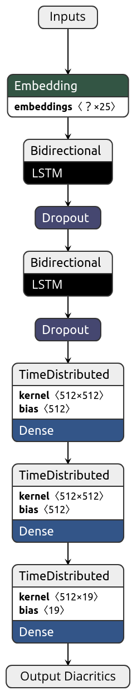

# shakkelha

This repository contains the models, dataset, helpers, and systems comparison for our paper on Arabic Text Diacritization:

"Neural Arabic Text Diacritization: Outperforming State of the Art Using FFNN and RNN", Ali Fadel, Ibraheem Tuffaha, Mahmoud Al-Ayyoub and Bara' Al-Jawarneh, [ACL 2019](http://www.acl2019.org).

## Files

- predict.py - General script can be used to predict any model output:
- sample-input - Sample input file

### [dataset](/dataset)

- extra_train.zip - Contains the extra training dataset that was used to train the models

### [comparisons](/comparisons)

- abandah - Contains the generated dataset, system output and DER/WER statistics used to compair our system with [Abandah et al., 2015](https://link.springer.com/article/10.1007/s10032-015-0242-2)
- belinkov - Contains the generated dataset, system output and DER/WER statistics used to compair our system with [Belinkov et al., 2015](https://www.aclweb.org/anthology/D15-1274)
- shakkala - Contains the generated dataset, system output and DER/WER statistics used to compair our system with [Barqawi et al., 2017](https://github.com/Barqawiz/Shakkala)

### [helpers](/helpers)

- constants
  - ARABIC_LETTERS_LIST.pickle - Contains list of Arbaic letters
  - DIACRITICS_LIST.pickle - Contains list of all diacritics
  - FFNN_CLASSES_MAPPING.pickle - Contains a dictionary maps the class to its unique integer (FFNN)
  - FFNN_REV_CLASSES_MAPPING.pickle - Contains a dictionary maps the integer to its unique class (FFNN)
  - FFNN_SMALL_CHARACTERS_MAPPING.pickle - Contains a dictionary maps the character to its unique integer (Without using the extra training dataset for FFNN)
  - RNN_CLASSES_MAPPING.pickle - Contains a dictionary maps the class to its unique integer (RNN)
  - RNN_REV_CLASSES_MAPPING.pickle - Contains a dictionary maps the integer to its unique class (RNN)
  - RNN_SMALL_CHARACTERS_MAPPING.pickle - Contains a dictionary maps the character to its unique integer (Without using using the extra training dataset for RNN)
  - RNN_BIG_CHARACTERS_MAPPING.pickle - Contains a dictionary maps the character to its unique integer (Using using the extra training dataset for RNN)
- avg_checkpoints.py - Creates averaged models using the last epochs checkpoints from the training phase
- build_confusion_matrix.py - Builts and plots confusion matrix using the gold and predicted diacritization
- build_der_figure.py - Restores and plots the diacritic error rate progress while training for each model from keras training log files
- plot_character_embeddings.py - Plots embeddings extracted from any epoch checkpoint using t-SNE
- count_error_frequency.py - Counts the frequency of errors in each diacritized word
- prepare_feed_forward_data.py - Prepares FFNN models data
- restore_model_accuracy_and_loss.py - Restores and plots the accuracy and loss values for FFNN models from keras training log files
- optimizer.py - An implementation for [Block-Normalized Gradient Method: An Empirical Study for Training Deep Neural Network](https://arxiv.org/abs/1707.04822) paper copied from [here](https://github.com/titu1994/keras-normalized-optimizers)

### [models](/models)

- ffnn_models - Contains all feed-forward neural networks codes, models and statistics
  - 1_basic_model - Contains basic FFNN model training and predicting codes, model weights and DER/WER statistics
  - 2_100_hot_model - Contains 100 hot FFNN model training and predicting codes, model weights and DER/WER statistics
  - 3_embeddings_model - Contains embeddings FFNN model training and predicting codes, model weights and DER/WER statistics
- rnn_models - Contains all recurrent neural networks codes, models and statistics
  - 1_basic_model - Contains basic RNN model training code, model weights, averaged models and DER/WER statistics. The model was trained with and without the extra training dataset
  - 2_crf_model - Contains CRF-RNN model training code, model weights, averaged models and DER/WER statistics. The model was trained with and without the extra training dataset
  - 3_normalized_model - Contains normalized RNN model training code, model weights, averaged models and DER/WER statistics. The model was trained with and without the extra training dataset
  
## Usage

### To Predict

To predict the diacritized text using any model provided in this repository the script `predict.py` can be used, example:
```bash
python predict.py --input-file-path sample_input --model-type rnn --model-number 3 --model-size small --model-average 20 --output-file-path sample_output
```
The previous line will diacritize the text inside `sample_input` file using the `rnn` model that have number `3` trained on the `small` dataset (without extra training dataset) after averaging the last `20` epochs and writes the diacritized text on `sample_output`.

The allowed option are:

- --model-type: ffnn, rnn
- --model-number:
  - ffnn: 1, 2, 3
  - rnn: 1, 2, 3
- --model-size: small, big
- --model-average:
  - rnn: 1, 5, 10, 20

### To Train FFNN Model

Before training any FFNN model you need to prepare the dataset using `prepare_feed_forward_data.py` script. After that to train any FFNN model you can use the `model.ipynb` notebooks exist under `models/ffnn_models/*/`

### To Train RNN Model

There is no need to prepare any data to train RNN models, to train any RNN model you can use the `model.ipynb` notebooks exist under `models/rnn_models/*/`

Note that the RNN models use `CuDNNLSTM` layers which should run on GPU, to train the models or predict output from them using CPU only you can use regular `LSTM` layers. Moreover, all RNN models checkpoints exist under `models/rnn_models/*/` are use `CuDNNLSTM` layers, so the checkpoints should be loaded on GPU, but under `model/rnn_models/*/lstm/` there are the same checkpoints with same weights and structures but with regular `LSTM` layers used instead of `CuDNNLSTM` layers.

#### Note: All codes in this repository tested on [Ubuntu 18.04](http://releases.ubuntu.com/18.04)

<p align="center">
  
</p>
<p align="center">
  Basic RNN model structure
</p>

## Contributors
1. [Ali Hamdi Ali Fadel](https://github.com/AliOsm).<br/>
2. [Ibraheem Tuffaha](https://github.com/IbraheemTuffaha).<br/>
3. [Mahmoud Al-Ayyoub](https://github.com/malayyoub).<br/>
4. [Bara' Al-Jawarneh](https://github.com/baraajaw).<br/>

## License
The project is available as open source under the terms of the [MIT License](https://opensource.org/licenses/MIT).
